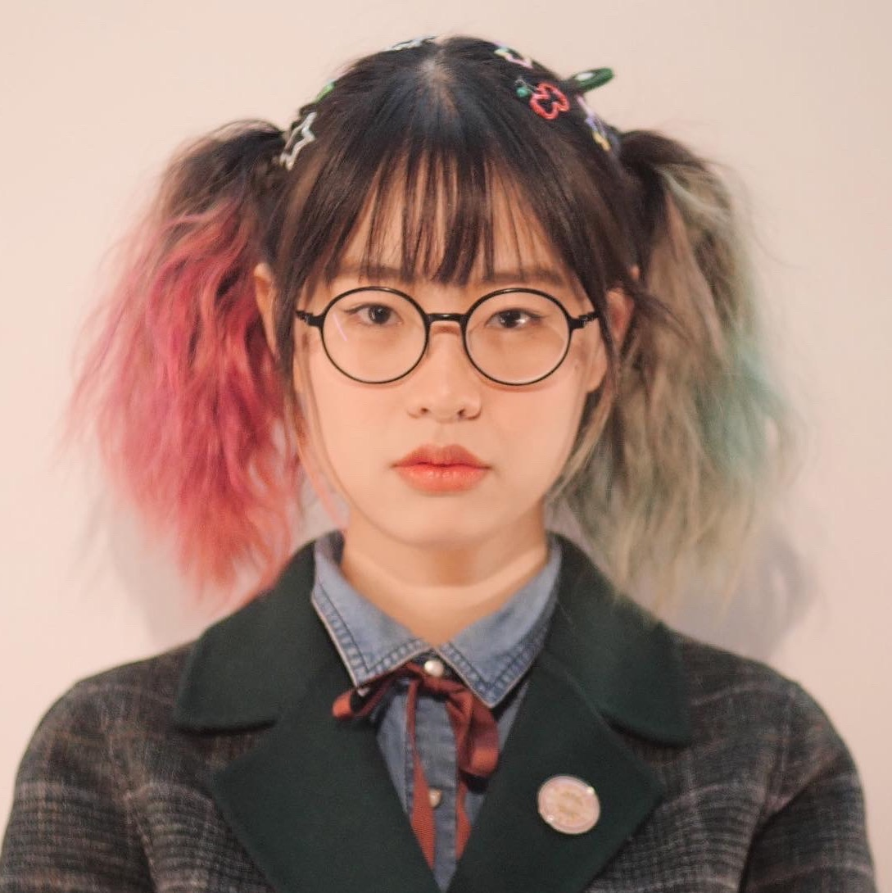

<!--  -->
<div align=center></div>

<!-- 
```
 full-time Researcher
 underground Artist
``` -->


<center> 📖   __full-time Researcher__    📖 </center>

<center> 🎨    __underground Artist__     🎨 </center>


| __Computational Media Art__ | __Female__ | __E-mail:__ yufanli@ust.hk | 
| __HKUST__ | __Beijing, China__ | __Phone:__ (+86)18811365529 |


## Education

`2018/09 - 2021/06`
__Tongji University, Shanghai, China__
 - Master of Engineering in Design, Artificial Intelligence and Data Design
 - __GPA:__ 86.74/100 
  <!-- ``` - __Supervisor:__ Ling Fan, __co-Supervisor:__ Harry Jiannan Wang ``` -->


`2019/09 - 2020/07`
__Politecnico di Torino, Turin, Italy__
 -  Systemic Design, Exchange Program


`2014/09 - 2018/06`
__Beijing Institute of Technology, Beijing, China__
 - Bachelor of Engineering, Vehicle Engineering
- __GPA:__ 3.93/4 (top 10%)


## Research Publications

### Papers
`2022`
Fan, Zhenbao & Zhu, Yixuan & Yan, Christine & __Li, Yufan__ & Zhang, Kang.  "A Comparative Study of Color Between Abstract Paintings, Oil Paintings and Chinese Ink Paintings," in The 15th International Symposium on Visual Information Communication and Interaction (VINCI), Chur, Switzerland, 2022

`2021`
__Li, Yufan__ & Zhuo, Jinggang & Fan, Ling & Wang, Harry.  "Culture-inspired Multi-modal Color Palette Generation and Colorization: A Chinese Youth Subculture Case," in 2021 IEEE 4th International Conference on Multimedia Information Processing and Retrieval (MIPR), Tokyo, Japan, 2021 pp. 382-385. doi: 10.1109/MIPR51284.2021.00071
__Links:__ [Paper](https://doi.ieeecomputersociety.org/10.1109/MIPR51284.2021.00071)｜[Code & Introduction](https://github.com/tezignlab/subculture-colorization) ｜ [Video](https://youtu.be/fLPwr-oX0ds)｜[Demo](https://www.subverse.site/)


`2021`
__Li, Yufan__ & Zhuo, Jinggang & Fan, Ling & Wang, Zhe & Wang, Harry. "Semantically Enriched Music Visualization via Multimodal Color Generation," in NIME 2021 Showcase. 
__Links:__ [Paper](https://doi.org/10.21428/92fbeb44.2fb614f7)｜[Code](https://github.com/tezignlab/subculture-colorization/tree/main/music-visualization)｜[Video](https://www.bilibili.com/video/BV1Cp4y1H7To/) 


`2021`
__Master Degree Thesis__   受文化启发的智能色彩设计系统与原型开发————以中国青年亚文化为例（Research of Culture-inspired Intelligent Color Design System: A Chinese Youth Subculture Case） J063/LC213，in 2021， 同济大学图书馆藏(Record in the Library of  Tongji University)

<!-- --- -->
### Book
`2019`
__as Academic Contributor:__ Fan Ling. From Infinite Computing Power to Infinite Imagination: An Overview of Design Artificial Intelligence (从无限运算力到无限想象力: 设计人工智能概览) [M/OL]. Tongji University Press, 2019.

<!-- --- -->
### Patents of Invention

`2021`
An image coloring method based on multimodal content encoding(一种基于多模态内容编码的图像着色方法)，Published Code：CN113888660A，Statement：in Pratical Review(审中-实审), inventor: Fan Ling & Wang Harry & __Li Yufan__ & Zhuo Jinggang, Tongji University


`2021`
A method of visualizing musical colors based on musical semantics(一种基于音乐语义的音乐色彩可视化方法)，Published Code：CN113920971A，Statement：in Pratical Review(审中-实审), inventor: Fan Ling & Wang Harry & __Li Yufan__ & Zhuo Jinggang, Tongji University


## Art Exhibitions

`2022/03-2022/04`
__"Worries Overloaded"__, BadWater, PLATESPACE, Beijing

`2021/09-2021/10`
__"Deviant Colors"__, Solo Exhibition, fRUITYSPACE, Beijing

`2021/03-2021/04`
__"Digital Organisms"__, Group Exhibition, The 13th Shanghai Biennale Phase II: Eco Alliance. "Institutions And Colleges", Power Station of Art, Shanghai


## Research Experience
`2018 - 2022`
__as Research Assistant:__ [CMA Thrust](https://cma.hkust-gz.edu.cn/), Infomation Hub, The Hong Kong University of Science and Technology (Guangzhou)

`2018 - 2022`
__as Researcher:__ [Design A.I. Lab](https://www.sheji.ai/), Design and Innovation College, Tongji University

`2015 - 2017`
__as Engineer:__ Formula Racing Team of BIT, Beijing Institute of Technology 

__as Reviewer:__ Reviewer for Leonardo journal; Subreviewer for VINCI'22 and ICTAI'22 conference.


## Awards

`2016` `National` Grand Prize of Industrial Information Innovation Scholarship 2016(年度工信创新创业特等奖学金), Awarded as a team member

`2016` `National` Group First prize of Formula Student China

`2015` `National` Advanced Modeling and Product Design Contest of China, Individual First Prize & Group First prize

`2015` `Province-wide` Undergraduate Engineering Design Expression Contest of Beijing, Individual First Prize

`2014 - 2018` `Inter-school` Awarded Several First-class Scholarships of BIT


## Occupation
`2022/03 - now`
__Research Assistant__
 - CMA Thrust, Information Hub,the Hong Kong University of Science and Technology, Guangzhou.

`2021/08 - 2022/03`
__Senior Product Manager__
 - Pingan Technology Company, Beijing.

`2019/02 - 2019/06`
__Product Assistant (Intern)__ 
 - Tezign Technology Company, Shanghai


<!-- ### Footer

Last updated: August 2022 -->


