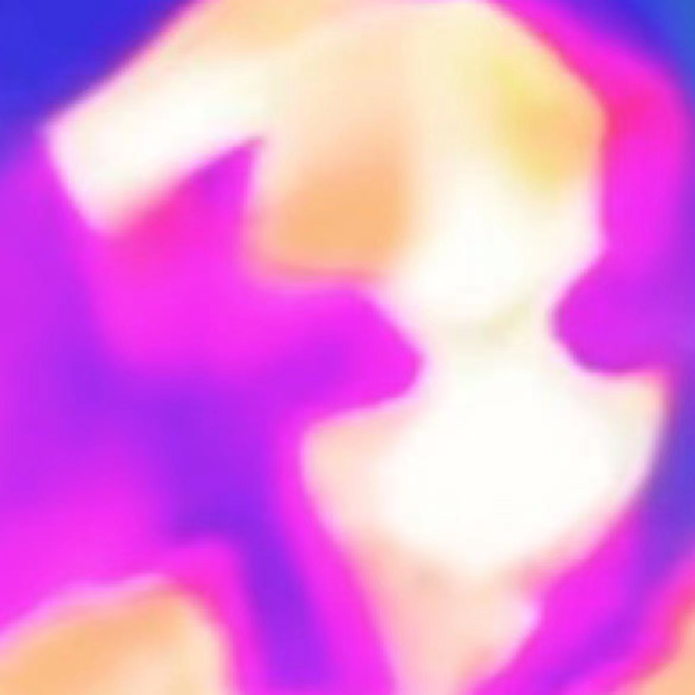
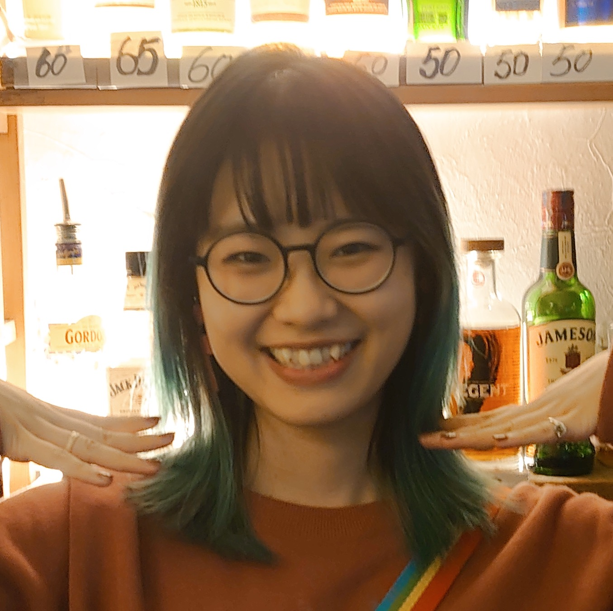

<!--  -->
<div align=center></div>

<!-- 
```
 full-time Product Manager
 part-time Researcher
 underground Artist
``` -->

<center> 💾 __full-time Product Manager__ 💾 </center>

<center> 📖   __part-time Researcher__    📖 </center>

<center> 🎨    __underground Artist__     🎨 </center>


| __Master of Engineering in Design, AI & Data Design__ | __Tongji University__ |
| __Female__ | __Beijing, China__ | 
| __E-mail:__ yuvan_lee@163.com | __Phone:__ (+86)18811365529 |


## Education

`2018/09 - 2021/06`
__Tongji University, Shanghai, China__
 - __Master of Engineering in Design, Artificial Intelligence and Data Design__
   - __GPA:__ 86.74/100
   - __Supervisor:__ Ling Fan, __co-Supervisor:__ Harry Jiannan Wang

<!-- --- -->
`2019/09 - 2020/07`
__Politecnico di Torino, Turin, Italy__
 -  __Systemic Design, Exchange Program__

<!-- --- -->
`2014/09 - 2018/06`
__Beijing Institute of Technology, Beijing, China__
 - __Bachelor of Engineering, Vehicle Engineering__
   - __GPA:__ 89.09/100 (top 10%)


## Research Publications

### Papers
`2021`
__Li, Yufan__ & Zhuo, Jinggang & Fan, Ling & Wang, Harry.  "Culture-inspired Multi-modal Color Palette Generation and Colorization: A Chinese Youth Subculture Case," in 2021 IEEE 4th International Conference on Multimedia Information Processing and Retrieval (MIPR), Tokyo, Japan, 2021 pp. 382-385. doi: 10.1109/MIPR51284.2021.00071
__Links:__ [Paper](https://doi.ieeecomputersociety.org/10.1109/MIPR51284.2021.00071)｜[Code & Introduction](https://github.com/tezignlab/subculture-colorization) ｜ [Video](https://youtu.be/fLPwr-oX0ds)｜[Demo](https://www.subverse.site/)


`2021`
__Li, Yufan__ & Zhuo, Jinggang & Fan, Ling & Wang, Zhe & Wang, Harry. "Semantically Enriched Music Visualization via Multimodal Color Generation," in NIME 2021. 
__Links:__ [Paper](https://doi.org/10.21428/92fbeb44.2fb614f7)｜[Code](https://github.com/tezignlab/subculture-colorization/tree/main/music-visualization)｜[Video](https://www.bilibili.com/video/BV1Cp4y1H7To/) 


`2021`
__Master Dgree Thesis__   受文化启发的智能色彩设计系统与原型开发————以中国青年亚文化为例 J063/LC213，in 2021， 同济大学图书馆藏

<!-- --- -->
### Patents

`2021`
一种基于多模态内容编码的图像着色方法，公开(公告)号：CN113888660A，状态：审中-实审, 发明人：范凌，王建楠，__李与凡__，卓京港，申请人：同济大学


`2021`
一种基于音乐语义的音乐色彩可视化方法，公开(公告)号：CN113920971A，状态：审中-实审, 发明人：范凌，王建楠，__李与凡__，卓京港，申请人：同济大学

<!-- --- -->
### Book
`2019`
__as Academic Contributor:__ 范凌. 从无限运算力到无限想象力: 设计人工智能概览[M/OL]. 同济大学出版社, 2019.


## Research Experience
`2018 - now`
__as Researcher:__ [Design A.I. Lab](https://www.sheji.ai/), Design and Innovation College, Tongji University, 


`2021`
__as Paper Presenter:__ [The 3rd IEEE Workshop on Artificial Intelligence for Art Creation](https://aiart2021.github.io/), Jointly with MIPR 2021


`2015 - 2017`
__as Engineer:__ Formula Racing Team of BIT, Beijing Institute of Technology 


`2016`
__as Engineer & Presenter:__ Formula Student China 2016 & Formula Student Electric China 2016


## Art Exhibition

`2021/03-2021/04`
__"Digital Organisms"__, Group Exhibition, The 13th Shanghai Biennale Phase II: Eco Alliance. "Institutions And Colleges", Power Station of Art, Shanghai

`2021/09-2021/10`
__"Deviant Colors"__, Solo Exhibition, fRUITYSPACE, Beijing


## Awards

`2016` 年度工信创新创业奖学金, Awarded as a team member.

`2016` Formula Student China, Group First prize.

`2015` Advanced Modeling and Product Design Contest of China, Individual First Prize & Group First prize.

`2015` Undergraduate Engineering Design Expression Contest of Beijing, Individual First Prize.

`2014 - 2018` Awarded Several First-class Scholarships of BIT


## Occupation

`2021/08 - now`
Advanced Product Manager, Pingan Technology Company, Beijing.


`2019/02 - 2019/06`
Product Assistant, Tezign Technology Company, Shanghai


<!-- ### Footer

Last updated: May 2013 -->


